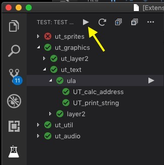

# Support

If you like the "Z80 Unit Test Adapter" please consider supporting it.

&nbsp;&nbsp;

# Z80 Unit Test Adapter

This is a unit test adapter for the Z80 assembler language.
It allows to run unit tests very comfortable from the vscode UI.

The adapter is just a mediator, it requires other extensions
- [DeZog (Z80 Debugger)](https://github.com/maziac/dezog)
- [Test Explorer](https://marketplace.visualstudio.com/items?itemName=hbenl.vscode-test-explorer)

## Gallery

# Howto

An explanation how to prepare your assembler sources to use unit tests can be found [here](https://github.com/maziac/dezog/blob/master/documentation/UnitTests.md).
Note: You can also load a sample program with unit test setup from here: [z80-sample-program](https://github.com/maziac/z80-sample-program).

If this is working (i.e. you can execute Z80 unit tests from the command palette) then the z80-unit-tests extension should run out-of-the box:

1. Enter the testing area:

2. Refresh (retrieve addresses of the unit test cases):

3. Navigate to the unit test you want to execute:

4. Hover over it and select Debug, Run or Goto:

5. Run a single unit test. A successful unit test execution will be indicated by a green arrow:

6. Execute all unit tests:

7. A failed testcase is indicated by a red icon:

8. Jump to it:

9. See where it failed:

In this case register 'a' was tested for the number 1 ("TEST_A 1") but obviously it was 0.
The testcase failed and stopped here.
Please note that the code coverage indicated by the green background also stops here because the lines after the failure were not executed anymore.

# Log

There is a log available. If something does not work take a look there.

# What Else

You can have a look at the [z80-sample-program](https://github.com/maziac/z80-sample-program).
It also contains a complete setup for unit tests.

# Acknowledgements

This extension is based on the examples sources [vscode-example-test-adapter](https://github.com/hbenl/vscode-example-test-adapter) by Holger Benl

It makes use of the brilliant [Test Explorer](https://marketplace.visualstudio.com/items?itemName=hbenl.vscode-test-explorer) extension and API (also by Holger Benl).

# License

z80-unit-test is licensed under the [MIT license]().

The source code is available on [github]().

